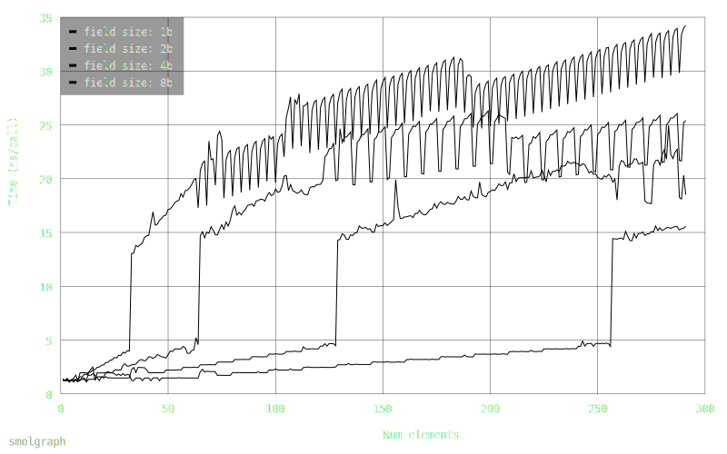

# Smolgraph

An extremely small, easy to use multi-line-graph library.

## Example

Live example: https://414owen.github.io/smolgraph/

## Features

* Small (<3.3k minified, and gzipped)
* Numeric or stringy x axis
* Pretty
* Themeable via css and some JS config
* Multiple lines
* Tracker visible on hover
* Displays points hovered over
* Scroll to zoom
* Pinch to zoom
* Double-click to zoom out
* Optional callback to load new data on zoom
